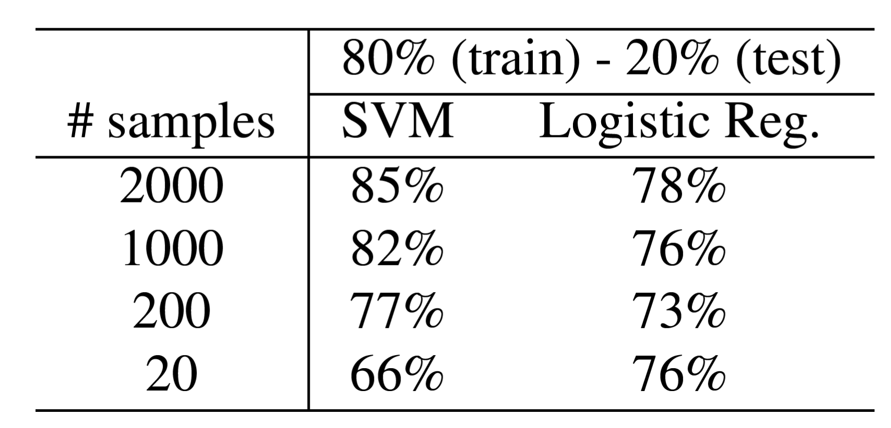

## Detection Faces-HQ 
To the best of our knowledge, no public dataset gathers images containing both artificially and real faces, therefore, we have created our own called Faces-HQ.
In order to have a sufficient variety of faces, we have chosen to download and label, images available from [CelebA-HQ dataset](https://arxiv.org/abs/1710.10196),
[Flickr-Faces-HQ dataset](https://arxiv.org/abs/1812.04948), [100K Facesproject](https://generated.photos/) and [www.thispersondoesnotexist.com](www.thispersondoesnotexist.com). 
In total, we have collected 40K high quality images being half of them real and the other half fake faces, achieving in this manner a balanced dataset.

Click [here](/Experiments_Faces-HQ) to go the experiments on Faces-HQ.

### Results

<b>Faces-HQ dataset.</b>
Test accuracy using SVM, logistic regression and k-means classifier under different data settings.

  
    

## Detection CelebA
 [CelebA](http://mmlab.ie.cuhk.edu.hk/projects/CelebA.html) CelebFaces Attributes Dataset (CelebA) is a large-scale face attributes dataset with more than 
200K celebrity images, each with 40 attribute annotations. The images in this dataset cover large pose variations and background clutter. CelebA has large 
diversities, large quantities, and rich annotations

Click [here](/Experiments_CelebA) to go the experiments on CelebA.

### Results

  
    

## Detection DeepFakeDetection (FaceForensics++)
 [FaceForensics++](https://github.com/ondyari/FaceForensics) is a forensics dataset consisting of video sequences that have been modified with
different automated face manipulation methods. Additionally,it is hosting DeepFakeDetection Dataset. In particular, this dataset contains 363 original
sequences from 28 paid actors in 16 different scenes as well as over 3000 manipulated videos using DeepFakes and their corresponding binary masks.
All videos contain a trackable mostly frontal face without occlusions which enables automated tampering methods to generate realistic forgeries.

Click [here](/Experiments_DeepFakeDetection) to go the experiments on DeepFakeDetection.

### Results

<b>DeepFakeDetection dataset.</b>

<i>Results based on frames.<i>

Test accuracy using SVM and logistic regression classifier under different data settings.

  
    

<i>Results based on videos. (We apply a simple majority vote over the single frame classifications).<i>

Test accuracy using SVM and logistic regression classifier.

  
    

